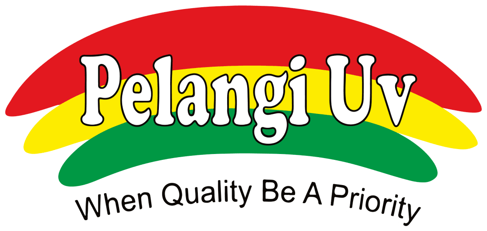

<p align="center">
  
</p>

<h1 align="center">CV Pelangi UV — Official Company & Digital Catalog Platform</h1>

<p align="center">
  <em>"When Quality Be A Priority" — Solusi Industri Finishing Percetakan & Distribusi Bahan Baku Pasca-Cetak Sejak 2004</em>
</p>

<p align="center">
  
  
  
  
  
  
</p>

<p align="center">
  <a href="https://github.com/Daffanugraha/Cv-Pelangi-Website"><strong>Explore Code »</strong></a>
  &nbsp;•&nbsp;
  <a href="#-fitur-utama-key-features">Fitur Unggulan</a>
  &nbsp;•&nbsp;
  <a href="#-tech-stack--arsitektur">Tech Stack</a>
  &nbsp;•&nbsp;
  <a href="#-cara-menjalankan-getting-started">Instalasi Lokal</a>
  &nbsp;•&nbsp;
  <a href="#-panduan-deploy-ke-vercel">Deploy ke Vercel</a>
</p>

---

## 📌 Ringkasan Proyek (Overview)

**CV Pelangi UV** adalah platform web kelas enterprise dan katalog digital modern yang dirancang khusus untuk memenuhi kebutuhan industri pasca-cetak (*print finishing*) di Indonesia. Berbasis di kawasan industri **Bizpark Tambak Sawah Sidoarjo**, platform ini mengintegrasikan profil perusahaan, etalase layanan finishing presisi, grosir bahan baku berkualitas tinggi, galeri interaktif hasil cetak dengan zoom inspeksi, blog edukasi industri percetakan, asisten konsultasi AI cerdas berbasis backend aman, serta **Admin CMS bawaan** untuk mengelola portofolio dan prospek (*leads*) secara terpusat.

Dibangun dengan arsitektur **Next.js 14 App Router**, TypeScript ketat (*strict type-safety*), dan Tailwind CSS teroptimasi, situs ini dirancang untuk kecepatan loading maksimal, SEO skor tinggi, serta responsivitas sempurna di seluruh perangkat desktop, tablet, dan smartphone.

---

## 🌟 Fitur Utama (Key Features)

### 1. 🎨 Showcase Jasa Finishing Lengkap
* **13+ Solusi Layanan Finishing Cetak**: Spot UV Gloss & Pasir Taktil presisi mikron, Hot Stamping Foil (Gold, Silver, Rose Gold, Hologram), Laminasi Thermal BOPP (Doff Halus, Glossy Bening, Velvet Soft-Touch, Anti-Scratch), Pond & Die-Cut Otomatis, Emboss/Deboss, Window Lamination, hingga Cast & Cure efek prisma mikro ramah lingkungan.
* **Spesifikasi Teknis Terperinci**: Informasi lengkap mencakup ukuran kertas maksimal plano, ketebalan gramatur (*GSM*), kapasitas harian mesin (200.000+ lembar/hari), serta estimasi waktu pengerjaan (*lead time*).

### 2. 📦 Katalog Grosir Bahan Baku
* **Distribusi Langsung Bahan Pasca-Cetak**: Pasokan bahan industri langsung: **Roll Foil Stamping** (panjang 120m standar & jumbo roll hingga 3.000m), **Thermal BOPP Film**, **Lem Wet/Dry Laminating & Hotmelt**, serta **Tinta & Varnish UV**.
* **Layanan Custom Slitting**: Jasa pemotongan lebar roll presisi tinggi (toleransi akurasi ±0.5 mm) sesuai spesifikasi mesin klien mitra.

### 3. 🖼️ Galeri Pengaplikasian Produk Interaktif
* **Koleksi Portofolio Nyata (18+ Variasi Produk)**: Menampilkan aplikasi nyata pada *Kemasan Rokok & Sigaret, Packaging Skincare & Parfum Luxury, Box Makanan Food-Grade, Hardcover Agenda & Annual Report, Kartu Nama Cotton & Identity, serta Paper Bag Butik*.
* **Sistem Pagination Dinamis (`1 2 3 ... N`)**: Navigasi halaman bernomor responsif dengan tombol *Previous/Next*, elipsis otomatis, dan auto-scroll yang mulus.
* **Tampilan Kartu Bersih & Elegan**: Visual kartu produk modern dan rapi tanpa chip/badge kaku yang menumpuk.
* **Filter Multi-Kategori & Pencarian Cepat**: Pilah portofolio berdasarkan aplikasi dan kebutuhan industri secara instan.
* **Modal Inspeksi Detail**: Zoom hasil cetak beresolusi tinggi, penjelas efek finishing yang digunakan, panduan pemilihan material, dan tombol pemesanan swatch sample kit fisik langsung.

### 4. 📰 Blog & Wawasan Industri Percetakan
* **Artikel Edukasi Teknis Terstruktur**: Panduan finishing kemasan pangan bersertifikat food-grade, standar cetak industri rokok, tips pencegahan kerut pada lipatan buku, dan inovasi ramah lingkungan Cast & Cure.
* **Filter Kategori, Pencarian Cerdas & Pagination Dinamis**: Navigasi artikel multi-halaman (`1 2 3 ... N`) untuk kemudahan eksplorasi informasi industri percetakan.

### 5. 🛡️ Sistem Manajemen Admin (CMS Terintegrasi)
* **Dasbor Analitik**: Monitor jumlah portofolio aktif, total calon klien (*leads*), dan status pesanan sampel fisik secara real-time.
* **Manajer Galeri**: Tambah, edit, dan hapus foto/video portofolio secara dinamis dengan fitur upload media langsung.
* **Manajemen Leads & Inquiries**: Pantau permintaan penawaran harga dari form kontak, filter status (*Baru, Dihubungi, Sampel Terkirim, Selesai*), dan tombol direct chat WhatsApp ke klien.
* **Pengaturan Platform**: Kelola nomor WhatsApp hotline, jam kerja operasional pabrik, meta SEO, serta ganti kredensial password admin.

### 6. 🌐 Dukungan Multi-Bahasa & Navigasi Cerdas
* **Fitur Alih Bahasa Instan**: Mendukung penuh alih bahasa **Bahasa Indonesia (ID)** dan **English (GB)** yang halus dan terstruktur.
* **Pencarian Global Cerdas (*Modal Search Catalog*)**: Akses cepat keyboard shortcut untuk menemukan layanan finishing dan bahan baku secara instan di seluruh situs.

### 7. 🤖 Pelangi AI Assistant (Asisten Konsultasi Teknis Cerdas)
* **Backend API Terisolasi & Aman**: Kunci API Google Gemini tersimpan aman di server-side (`/api/chat`), bebas dari risiko kebocoran di frontend.
* **Multi-Turn Context Awareness**: AI mengingat riwayat percakapan pengguna, memahami konteks pertanyaan lanjutan secara natural, dan mengenali sapaan personal pengguna.
* **Rekomendasi Terstruktur & Akurat**: Menjawab kebutuhan finishing kemasan (seperti rokok, skincare, dll.) secara padat, berbasis data resmi layanan dan bahan baku website.
* **Direct Hyperlink Tim Marketing**: Menghubungkan calon klien langsung ke nomor WhatsApp 3 representatif marketing (Ibu Dewi, Bpk. Hendra, Bpk. Bambang) serta hotline resmi CV Pelangi UV.

---

## 🛠️ Tech Stack & Ekosistem

| Lapisan | Teknologi | Kegunaan |
| :--- | :--- | :--- |
| **Framework** | [Next.js 14](https://nextjs.org/) (App Router) | Server-Side Rendering (SSR), Server Components, & API Route Handlers |
| **Bahasa** | [TypeScript 5](https://www.typescriptlang.org/) | Pengetikan statis ketat, keandalan kode, dan minim bug runtime |
| **Styling** | [Tailwind CSS 3](https://tailwindcss.com/) | Utilitas CSS modern dengan token desain kustom (*DESIGN.md*) |
| **Animasi** | [Framer Motion](https://www.framer.com/motion/) | Transisi halus, slider interaktif, carousel, dan efek hover mikro |
| **AI Backend** | Google Generative AI (Gemini Flash) | Pemrosesan bahasa alami untuk chatbot konsultan teknis cetak |
| **Ikon & Tipografi** | Google Fonts & Material Symbols | *Plus Jakarta Sans*, *Inter*, dan *Material Symbols Outlined* |
| **Deployment** | [Vercel](https://vercel.com/) | CI/CD otomatis dari repository GitHub, Edge Network global |

---

## 📁 Struktur Direktori Proyek

```bash
Cv-Pelangi-Website/
├── public/
│   ├── icons/                 # Favicon dan ikon aplikasi web
│   ├── images/                # Logo resmi, swatch bahan, dan aset visual
│   ├── videos/                # Video showcase beranda, profil workshop, dan bahan baku
│   └── uploads/               # Direktori penyimpanan media unggahan admin
├── src/
│   ├── app/                   # Next.js 14 App Router
│   │   ├── admin/             # Rute Admin (Login, Dashboard, Galeri, Leads, Pengaturan)
│   │   ├── api/               # API Route Handlers (Chat AI, Admin Auth, Gallery CRUD, Leads, Upload)
│   │   ├── bahan-baku/        # Halaman etalase grosir bahan baku finishing
│   │   ├── blog/              # Halaman blog & detail artikel wawasan industri
│   │   ├── galeri/
│   │   │   ├── pengaplikasian-produk/ # Galeri produk dengan pagination dinamis 1 2 3 ... N
│   │   │   └── momen-kegiatan/        # Galeri dokumentasi workshop & operasional
│   │   ├── kontak/            # Halaman kontak, marketing team, dan form penawaran
│   │   ├── layanan/           # Halaman portofolio layanan jasa finishing cetak
│   │   ├── globals.css        # Konfigurasi Tailwind & keyframes animasi
│   │   ├── layout.tsx         # Root layout utama & struktur HTML
│   │   └── page.tsx           # Halaman Beranda resmi (14 sections interaktif)
│   ├── components/
│   │   ├── layout/            # Navbar sticky, Footer pelangi, Floating WhatsApp & Chatbot
│   │   ├── sections/          # Komponen modular per halaman (Hero, Galeri, Kontak, Blog, dll.)
│   │   └── ui/                # Elemen UI reusable (Button, Modal, Input, Badge, Pagination)
│   ├── context/               # React Context (LanguageContext untuk ID/EN)
│   ├── data/                  # Database lokal JSON (admin-gallery, leads, settings)
│   └── lib/                   # Utilitas, modular data, auth helper, dan chatbot advisor
├── tailwind.config.ts         # Konfigurasi token warna, spacing, dan breakpoint
├── tsconfig.json              # Pengaturan compiler TypeScript
├── next.config.mjs            # Konfigurasi Next.js, rewrites, dan image pattern
└── package.json               # Daftar dependensi dan script proyek
```

---

## 🚀 Cara Menjalankan (Getting Started)

### Prasyarat:
* **Node.js**: Versi `18.17.0` atau yang lebih baru
* **npm** atau **yarn**

### Langkah Instalasi:

1. **Clone repository ini**:
   ```bash
   git clone https://github.com/Daffanugraha/Cv-Pelangi-Website.git
   cd Cv-Pelangi-Website
   ```

2. **Pasang seluruh dependensi**:
   ```bash
   npm install
   ```

3. **Konfigurasi Environment Variables**:
   Buat file `.env.local` di root folder proyek:
   ```env
   # API Key untuk Asisten AI (Server-Side Backend)
   GEMINI_API_KEY=your_gemini_api_key_here

   # Kredensial Login Admin Panel
   ADMIN_USERNAME=admin
   ADMIN_PASSWORD=your_secure_password
   ```

4. **Jalankan server pengembangan (Development Mode)**:
   ```bash
   npm run dev
   ```
   Buka peramban Anda di [http://localhost:3000](http://localhost:3000).

5. **Uji coba build produksi**:
   ```bash
   npm run build
   npm run start
   ```

---

## ☁️ Panduan Deploy ke Vercel (1-Click Deploy)

Website ini 100% kompatibel dan dioptimasi secara khusus untuk deployment di **Vercel**:

1. Buka [Vercel Dashboard](https://vercel.com/dashboard) dan masuk dengan akun GitHub Anda.
2. Klik tombol **"Add New..."** lalu pilih **"Project"**.
3. Cari dan pilih repository **`Daffanugraha/Cv-Pelangi-Website`**, lalu klik **"Import"**.
4. Di bagian **Environment Variables**, masukkan variabel yang dibutuhkan (`GEMINI_API_KEY` dan `ADMIN_PASSWORD`).
5. Klik **"Deploy"**. Dalam hitungan 1-2 menit, situs Anda sudah live di internet dengan domain aman SSL gratis!

---

<p align="center">
  Dikelola dengan dedikasi tinggi oleh <strong>CV Pelangi UV</strong> &bull; Hak Cipta &copy; 2026 Seluruh Hak Dilindungi.
</p>
